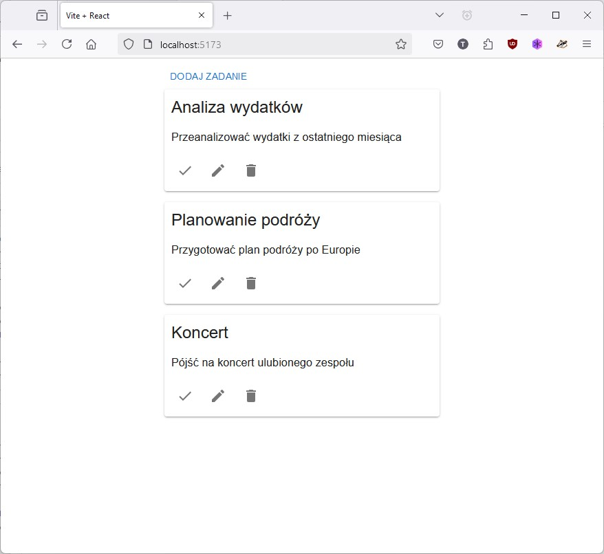
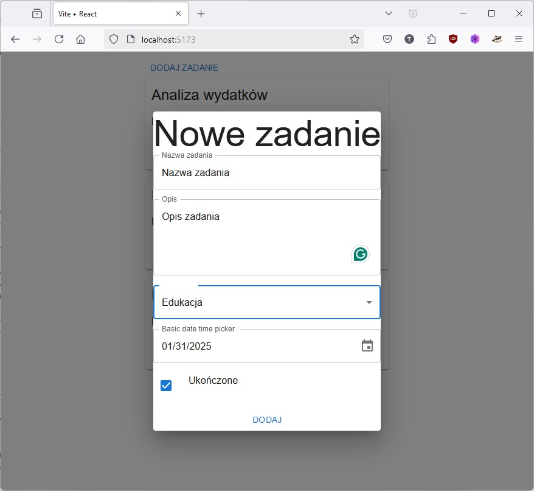

# Zajęcia 2 - Frontend (React + MaterialUI)

## Opis projektu / zadania

Celem zadania jest przygotowanie prostej aplikacji realizującej fronted dla listy zadań (to-do). Aplikacja powinna powstać w oparciu o bibliotekę **React** oraz **MaterialUI**. Aplikacja będzie komunikować się z backendem przez REST API. Do budowania aplikacji należy wykorzystać Vite (alternatywa dla **WebPacka**)

## Przygotowanie środowiska

- Stworzenie repozytorium `frontend` na GitHubie
- Instalacja Nodejs
- Stworzenie katalogu o nazwie `frontend`

## Aplikacja

### Tworzenie szkieletu aplikacji

Do stworzenia szkieletu należy wykorzystać szablony projektu **Vite**. W katalogu `frontend` należy wywołać poniższe polecenie.

```
npm create vite@latest . -- --template react
```

Po instalacji wszystkich zależności, można uruchomić aplikację. W tym celu należy wowłać poniższe polecenie.

```
npm run dev
```

Jeżeli aplikacja powinna być dostępna poza systemem na którym będzie uruchomiona, należy dodatkowo przekazać parametr `--host`.

```
npm run dev -- --host
```

### Przeglądanie aplikacji

Po uruchomieniu, szkielet aplikacji będzie dostępny pod adresem `http://localhost:5173`

### Instalacja zależności

Aplikacja będzie korzystać z następujących bibliotek:

- [Axios ](https://axios-http.com/docs/intro)
- [MaterialUI](https://mui.com/material-ui/)

Przed przystąpieniem do dewelopmentu, należy zainstalować wymagane biblioteki.

```
npm install @mui/material @emotion/react @emotion/styled @mui/icons-material @fontsource/roboto @mui/x-date-pickers dayjs axios
```

### Rozpoczęcie pracy nad aplikacją

#### Struktura katalogów

Struktura katalogów i plików projektu będzie wyglądać następująco.
```
.
├── eslint.config.js
├── index.html
├── package.json
├── package-lock.json
├── public
├── README.md
├── src
│   ├── App.jsx
│   ├── components
│   │   ├── CreateTodo.jsx
│   │   ├── EditTodo.jsx
│   │   └── TodoList.jsx
│   ├── config.js
│   ├── main.jsx
│   └── Todos.jsx
└── vite.config.js
```

#### Widok aplikacji

Aplikacja będzie wyglądać jak na screenach poniżej.

Okno główne aplikacji, lista zadań.



Okno dialogowe do tworzenia nowyh zadań.



## Kod aplikacji

### Komponent `App`

Główny komponent `App` ma następującą strukturę.

```jsx
const App = () => {
    return (
        <div style={{width: '400px', margin: 'auto'}}>
            <LocalizationProvider dateAdapter={AdapterDayjs}>
                <Button onClick={() => setOpen(true)}>Dodaj zadanie</Button>
                <CreateTodo categories={categories} open={open} onSave={handleSave}/>
                <TodoList todos={todos} onDelete={handleDelete} onUpdate={handleUpdate} onCompletion={handleCompletion}/>
            </LocalizationProvider>
        </div>
    )
}

export default App
```

Komponent definiuje dwa hooki `useEffect` które służą do pobierania danych.

```jsx
useEffect(() => {
    const url = `${API_BASE}/categories`
    axios.get(url).then(response => setCategories(response.data))
}, [])

useEffect(() => {
    getTodos()
}, 
```

Dodatkowo komponent przechowuje 3 stany:

```jsx
const [categories, setCategories] = useState([])
const [todos, setTodos] = useState([])
const [open, setOpen] = useState(false)
```

Oprócz hooków, komponent posiada 4 funkcje.

Funkcja `getTodos` będzie pobierać dane z backendu.
```jsx
const getTodos = () => {
    const url = `${API_BASE}/todos`
    axios.get(url).then(response => setTodos(response.data))
}
```

Funkcja `handleSave` będzie odpowiedzialna za zapis danych (tworzenie nowego zadania).
```jsx
const handleSave = (title, description, category, dueDate, completed) => {
    const url = `${API_BASE}/todos`
    const data = {
        title,
        description,
        category,
        due_date: dueDate,
        completed: completed == 'true' ? true : false,
    }

    axios.post(url, data).then(response => {
        setOpen(false)
        getTodos()
    })
}
```

Funkcja `hadleDelete` będzie odpowiedzialna za usuwanie zadań.

```jsx
const handleDelete = (id) => {
    const url = `${API_BASE}/todos/${id}`
    axios.delete(url).then(response => {
        getTodos()
    })
}
```

Oraz dwie funkcje `handleUpdate` i `handleCompletion` do aktualizaji zadań.
```jsx
const handleUpdate = (todo) => {
}

const handleCompletion = (id) => {
}
```


## Referencje

- [How to Install Node.js on Ubuntu 24.04](https://linuxconfig.org/how-to-install-node-js-on-ubuntu-24-04)
- [Scaffolding Your First Vite Project](https://vite.dev/guide/#scaffolding-your-first-vite-project)
- [Axios - examples](https://axios-http.com/docs/example)
