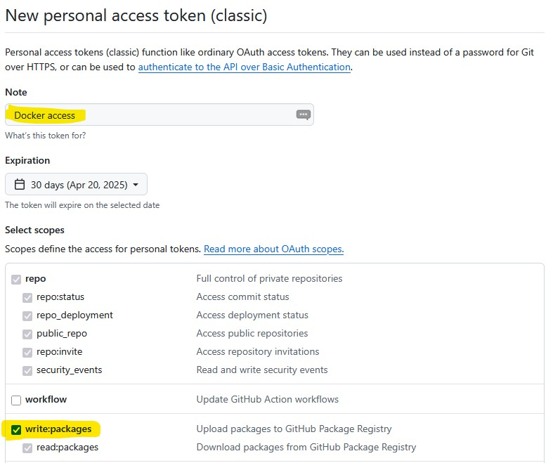

# Zajęcia 3 - Dokeryzacja i orkiestracja

## Opis projektu / zadania
Na tych zajęciach zajmiemy się dokerzacją napisanych wcześniej aplikacji.
Cel jest następujący: chcemy zamienić naszą aplikację w obraz dockerowy.
Wewnątrz obrazu będą znajdować się wszystkie potrzebne aplikacje i moduły aby aplikacja działała poprawnie.

Gdy powstaną przygotujemy obrazy frontendu i backendu, przejdziemy do kroku orkiestracji.
Aby całkowicie zautomatyzować proces tworzenia infrastruktury dla naszej aplikacji, napiszemy plik docker-compose który wszystko przygotuje.

## Dokeryzacja

### Backend

W głównym katalogu repozytorium stwórz nowy plik o nazwie `Dockerfile` z następującą zawartością:

```Dockerfile
FROM python:3.13-alpine

WORKDIR /app

COPY . /app

RUN pip install -r requirements.txt

ENTRYPOINT ["python"]
CMD ["app.py"]
```

Następnie wywołaj polecenie aby zbudować obraz. Obraz otrzyma nazwę `ptech-backend`:

```
docker build -t ptech-backend .
```

Gdy obraz się zbuduje, możemy sprawdzić czy działa prawidłowo. Zrobimy to poniższym poleceniem

```
docker run --rm -it -p 3000:3000 ptech-backend
```

Po uruchomieniu sprawdź czy backend działa prawidłowo, otwierając adres aplikacji w przeglądarce, np `http://localhost:3000`.
Aplikacja powinna działać prawidłowo, lecz odwołanie się do endpointu `/todos` wyświetli błąd komunikacji z bazą.
Tym zajmiemy się przy orkiestracji.

### Frontend

W głównym katalogu repozytorium stwórz nowy plik o nazwie `Dockerfile` z następującą zawartością:

```Dockerfile
FROM node:22 as build
                                                                                                                                                                                                                        WORKDIR /app
COPY package*.json ./
RUN npm install
COPY . .
RUN npm run build


FROM nginx:alpine

COPY --from=build /app/dist /usr/share/nginx/html
EXPOSE 80
CMD ["nginx", "-g", "daemon off;"]
```

## Testowanie obrazów

Najpierw należy uruchomić infrastrukturę korzystając z poniższego polecenia w repozytorium `backend`.

```
docker compose up -d 
```

Następnie należy uruchomić backend korzystając z obrazu. Użyj poniższego polecenia:


```
docker run --rm -it -p 3000:3000 -e DB_PORT=6033 --network=host  ptech-backend
```

Oraz fronted należy uruchomić fronted z obraz. Użyj poniższego polecenia:

```
docker run --rm -it -p 4000:80 ptech-frontend 
```

Otwórz przeglądarkę i załaduj poniższe adresy:

* http://localhost:4000/todos
* http://localhost:3000

## Automatyzacja inicjalizacji bazy

Przy obecnym rozwiązaniu, każdorazowe podniesienie infrastruktury (`docker compose up -d`) wymaga ręcznego wstawiania danych do bazy przez phpmyadmin.
Możemy to zautomatyzować. Szczegóły opisane są w dokumentacji obrazu (https://hub.docker.com/_/mysql/ sekcja Initializing a fresh instance).
Wystarczy zamontować plik sql z zapytaniami do katalogu `/docker-entrypoint-initdb.d`. Najczęściej pliki sql trzyma się w katalogu o nazwie `sql` montuje się caly katalog.
Do naszego rozwiązania, wystarczy zamontować plik. Do pliku `docker-compose.yaml` należy dodać nowy wolumen: `./database.sql:/docker-entrypoint-initdb.d/database.sql`.

```yaml
  db:
    image: mysql:latest
    container_name: db
    environment:
      MYSQL_ROOT_PASSWORD: my_secret_password
      MYSQL_DATABASE: app
      MYSQL_USER: user
      MYSQL_PASSWORD: password
    ports:
      - "6033:3306"
    volumes:
      - ./database.sql:/docker-entrypoint-initdb.d/database.sql
      - dbdata:/var/lib/mysql
```

Po tej zmianie, każdorazowe tworzenie kontenera bazy, wypełni automatycznie bazę danych.

## Orkiestracja

Zanim przystąpimy do orkiestracji i pisania pliku `docker-compose.yaml`, musimy umieścić obraz w docker registry w GitHubie.

### Tworzenie personal access token

Pierwszym krokiem jest wygenerowanie nowego tokena który umożliwi dostęp do registry. W GitHubie kliknij w awatar swojego profilu, a następnie **Settings** > po lewej, na samym dole **Developer settings** > **Personal access tokens** > **Tokens (classic)**. Kliknij w przycisk **Generate new token**.



W polu **Note** podaj nazwę nowego tokena na przykład *Docker access*, następnie w sekcji **Scope** zaznacz pozycję **write:packages**. Następnie kliknij w przycisk **Generate token**. Skopiuj nowy token, gdyż nie będzie możliwości jego podejrzenia w przyszłości. Jeżli zgubisz token, musisz wygenerować nowy.

### Logowanie do docker registry

Do logowania potrzebny będzie token. Wywołaj poniższe polecenie, jako hasło użyj wygenerowanego tokena.

```
docker login ghcr.io -u <nazwa-użytkownika>
```

Jeżeli wszystko zadziała prawidłowo, zobaczysz poniższy rezultat.

```
^^>>> docker login ghcr.io -u adam-taciak
i Info → A Personal Access Token (PAT) can be used instead.
         To create a PAT, visit https://app.docker.com/settings


Password:


WARNING! Your credentials are stored unencrypted in '/home/taciaka/.docker/config.json'.
Configure a credential helper to remove this warning. See
https://docs.docker.com/go/credential-store/

Login Succeeded
```

### Tagowanie obrazów i wypychanie do registry

Kolejnym krokiem jest otagowanie zbudowanych obrazów  i wypchnięcie ich do registry. Zacznijmy od backendu:

> [!WARNING]  
> Pamiętej aby podać poprawny adres do swojego konta!


```
docker tag ptech-backend ghcr.io/adam-taciak/ptech-backend:latest
docker push ghcr.io/adam-taciak/ptech-backend:latest
```
I dokładnie te same polecenia dla frontendu:

```
docker tag ptech-backend ghcr.io/adam-taciak/ptech-frontend:latest
docker push ghcr.io/adam-taciak/ptech-frontend:latest
```


Więcej informacji w dokumentacji GitHuba https://docs.github.com/en/packages/working-with-a-github-packages-registry/working-with-the-container-registry
